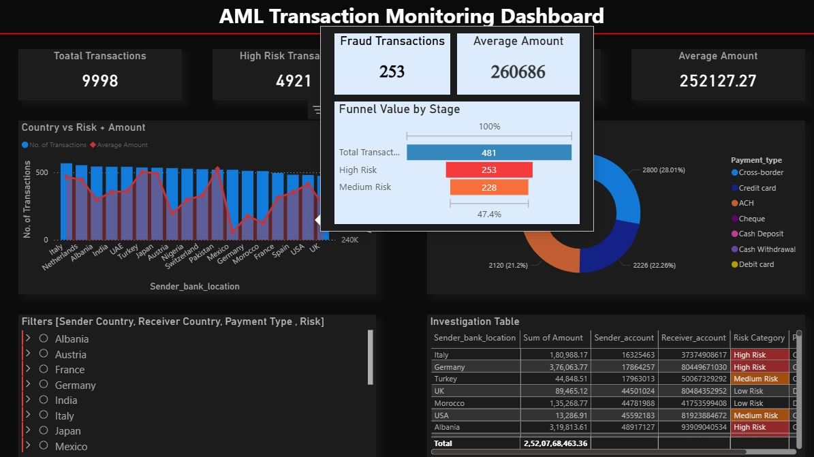
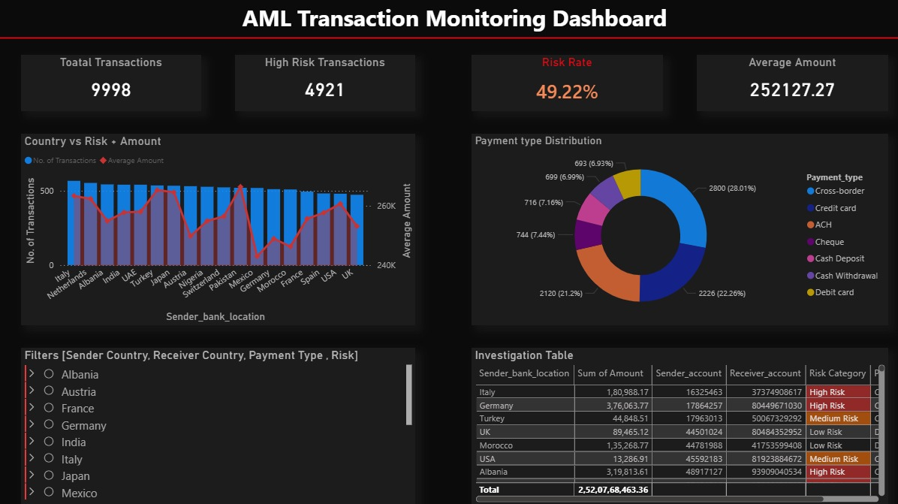
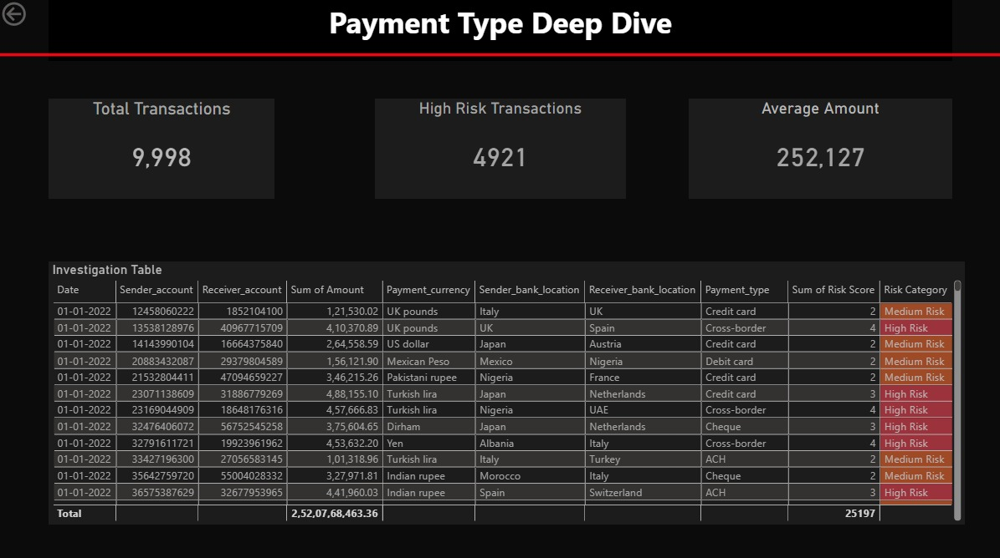

# AML Transaction Monitoring Dashboard

## Overview
This project focuses on detecting and analyzing suspicious financial transactions that may indicate money laundering activities. It combines SQL-based data analysis with Power BI visualization to identify high-risk patterns and provide actionable insights.

## Tools & Technologies
- SQL (Data extraction, filtering, aggregation)
- Power BI (Dashboard & visualization)
- Excel / CSV Dataset

## Dataset
- aml_bank_transactions.csv contains transaction-level financial data including sender, receiver, transaction amount, country, and payment type.

## SQL Usage
- Extracted and filtered transaction data based on risk indicators
- Performed aggregations to identify high-risk transactions
- Applied conditional queries to classify transactions into High, Medium, and Low risk categories
- Generated insights for dashboard visualization

## Features
- Total Transactions, High Risk Transactions, and Risk Rate metrics
- Country-wise transaction and risk analysis
- Payment type distribution (Credit card, ACH, Cross-border, etc.)
- Risk categorization (High, Medium, Low)
- Interactive filters (Country, Payment Type, Risk Level)
- Investigation table for detailed transaction-level analysis

## Dashboard Preview

## Insights
- Identified high-risk transactions based on transaction patterns and attributes
- Highlighted countries and payment types with higher fraud probability
- Provided a structured view for financial investigation and monitoring

## Files
- aml_dashboard.zip
- aml_bank_transactions.csv
- screenshots/
